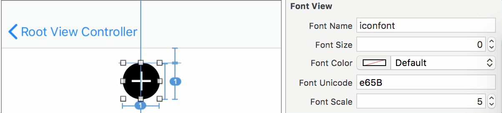

# BLUIKit

[](https://travis-ci.org/158179948@qq.com/BLUIKit)
[](http://cocoapods.org/pods/BLUIKit)
[](http://cocoapods.org/pods/BLUIKit)
[](http://cocoapods.org/pods/BLUIKit)

## Installation

BLUIKit is available through [CocoaPods](http://cocoapods.org). To install
it, simply add the following line to your Podfile:

```ruby
pod 'BLUIKit'
```

## Doc

- BLFontView: 一个自定义字符展示控件,支持xib与storyboard操作.
  

## Author

linhey, linhan.bigl055@outlook.com

## License

BLUIKit is available under the MIT license. See the LICENSE file for more info.

